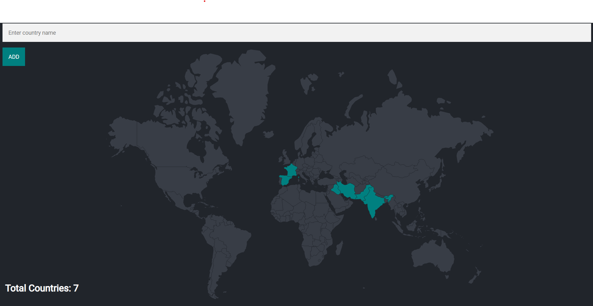

# Trek Mark

## Project Description

The Trek Mark project is designed to track countries visited by users and count them. It utilizes PostgreSQL for database management and integrates with Node.js for backend operations.

## Screenshots



## Table of Contents

- [Trek Mark](#travel-tracker)
- [Project Description](#project-description)
- [Screenshots](#Screenshots)
- [Table of Contents](#table-of-contents)
- [Installation](#installation)
- [Usage](#usage)
- [Database Setup](#database-setup)


## Installation

1. Clone the repository:

   ```bash
   git clone https://github.com/your-username/your-repository.git
   Certainly! Here's the provided text converted into Markdown format:
   ```

````markdown
# Trek Mark

## Install Dependencies

To install dependencies, run the following command:

```bash
npm install
```
````

## Set Up Environment Variables

1.  Create a `.env` file in the root directory with the following contents:

    ```plaintext
    DB_USER=your_database_user
    DB_PASSWORD=your_database_password
    DB_HOST=your_database_host
    DB_DATABASE=your_database_name
    DB_PORT=your_database_port
    ```

    Adjust these variables according to your PostgreSQL database configuration.

## Start the Application

To start the application, run:

```bash
npm start
```

## Usage

Explain how to use your project here.

## Database Setup

Explain how to set up your PostgreSQL database for this project.
Certainly! Here’s how you can explain setting up your PostgreSQL database for your project in the README.md file:

````markdown
## Database Setup

### Setting Up PostgreSQL Database

1. **Install PostgreSQL:**

   If you haven't already installed PostgreSQL, download and install it from [PostgreSQL Downloads](https://www.postgresql.org/download/).

2. **Create Database:**

   Open your PostgreSQL command-line interface or use a GUI tool like pgAdmin.

   ```sql
   CREATE DATABASE myWorld;
   ```
````

Replace `myWorld` with your preferred database name.

3.  **Create Tables:**

    Design your database schema and create tables according to your project's requirements. Here's a basic example using SQL:

    ```sql
    CREATE TABLE countries (
        id SERIAL PRIMARY KEY,
        name VARCHAR(100) NOT NULL,
        visited BOOLEAN DEFAULT FALSE
    );
    ```

    ```-- Create the visited_countries table
    CREATE TABLE visited_countries (
        id SERIAL PRIMARY KEY,
        country_code VARCHAR(3) REFERENCES          
         countries(country_code)
        );
    ```

    Modify the table structure based on what information you need to store.

4.  **Set Up Database Connection:**

    Update your `.env` file in the project's root directory with your PostgreSQL connection details:

    ```plaintext
    DB_USER=your_database_user
    DB_PASSWORD=your_database_password
    DB_HOST=localhost
    DB_DATABASE=myWorld
    DB_PORT=5432
    ```

    Adjust these variables to match your PostgreSQL configuration.

5.  **Run Migrations (Optional):**

    If your project uses database migrations (e.g., with Knex.js, Sequelize), run migrations to create tables and seed initial data.

    ```bash
    npm run migrate:latest
    ```

    Replace `npm run migrate:latest` with the appropriate command for your migration tool.

6.  **Start the Application:**

    After setting up the database, start your Node.js application:

    ```bash
    npm start
    ```

    Ensure your application connects to PostgreSQL using the provided environment variables.

7.  **Verify Database Connection:**

    Test your application to ensure it successfully connects to the PostgreSQL database and performs CRUD operations as expected.

By following these steps, you can set up your PostgreSQL database for the project, define its structure, and integrate it with your Node.js application.

```css

This guide provides a structured approach to setting up a PostgreSQL database for your project, including initial setup, table creation, environment configuration, optional migrations, and starting the application. Adjust the SQL queries and commands based on your specific database schema and project requirements.
```
